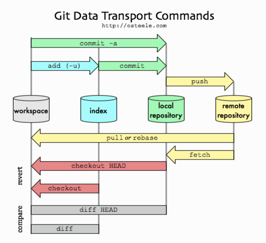

# Git

- Gestion de configuration
- Fonctionnement _à la ligne_
- Décentralisé, pas _forcément_ besoin d'un serveur
- Branches, _cherry-pick_, tag, fusion

## Création d'un _repository_ en local

`git init`

## Cloner un repository existant

`git clone url-de-votre-repo`

> git clone https://github.com/ViBiOh/l3miage.git

> git clone git@github.com:ViBiOh/l3miage.git

## Connaître l'état de la copie locale

`git status`

## Ajouter un fichier au système de version

`git add nom_de_votre_fichier`

> git add README.md

### En mode interactif pour ajouter seulement ceux souhaités

`git add -i`

### En mode interactif pour ajouter seulement les sous-parties

`git add -p`

### Annuler les modifications locales

`git checkout -- [nom_de_votre_fichier]`

### Annuler les modifications déjà ajoutées

`git reset HEAD -- [nom_de_votre_fichier]`

### Créer une branche à partir de la branche courante

`git checkout -b features/awesome`

### Changer de branche

`git checkout master`

### Mettre de côté ses modifications

`git stash`

### Réappliquer les modifications mises de côté

`git stash pop`

## Valider localement ses modifications

`git commit -m "commentaire de votre commit"`

> git commit -m "Initial commit. CR By John Doe"

## Pousser ses modifications sur le serveur

`git push`

### En précisant la destination, la branche

`git push nom-du-serveur-distant nom-de-la-branche`

> git push origin master

### En précisant la destination, la branche, la référence locale

`git push nom-du-serveur-distant référence-du-commit:nom-de-la-branche`

> git push origin HEAD:master

Ne pas oublier le **HEAD** car `git push origin :master` supprime la branche

## Récupérer les modifications du serveur

`git pull`

### En précisant la source, la branche

`git pull nom-du-serveur-distant nom-de-la-branche`

> git pull origin master

### Récupérer les modifications d'une autre branche sur la sienne

`git pull --rebase=false nom-de-la-branche-dont-on-veut-les-modifications`

> git pull --rebase=false origin master

# Références

- [Un guide interactif et visuel](http://git-school.github.io/visualizing-git/#free)
- [La documentation officielle](http://git-scm.com/book/fr/v1)
- [GitFlow](http://nvie.com/posts/a-successful-git-branching-model/)
- [Configuration](https://delicious-insights.com/fr/articles/configuration-git/)
- [Merge vs Rebase](https://medium.com/@porteneuve/getting-solid-at-git-rebase-vs-merge-4fa1a48c53aa)
